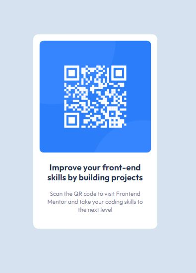

# Frontend Mentor - QR code component solution

This is a solution to the [QR code component challenge on Frontend Mentor](https://www.frontendmentor.io/challenges/qr-code-component-iux_sIO_H). Frontend Mentor challenges help you improve your coding skills by building realistic projects. 

## Table of contents

- [Overview](#overview)
  - [Screenshot](#screenshot)
  - [Links](#links)
- [My process](#my-process)
  - [Built with](#built-with)
  - [What I learned](#what-i-learned)
  - [Continued development](#continued-development)
  - [Useful resources](#useful-resources)
- [Author](#author)
- [Acknowledgments](#acknowledgments)

## Overview

### Screenshot

### Links

- Solution URL: [Add solution URL here](https://your-solution-url.com)
- Live Site URL: [Add live site URL here](https://your-live-site-url.com)

## My process

I began with the mobile design first, and for this particular project I found that media queries were not necessary. I created my containers first and then worked on styling from the top of the page, down.

### Built with

- Semantic HTML5 markup
- CSS3
- Flexbox
- Mobile-first workflow

### What I learned

This was very similar to the NFT preview card component project I completed last week through Frontend Mentor. I used feedback that I received from a fellow coder on my NFT project to group the entire QR card into a <main> element, and then apply the below code to keep it centered on the page.

main {
    display: flex;
    justify-content: center;
    align-items: center;
    min-height: 100vh;
  }  

### Continued development

The above tip will definitely be implemented in my future projects.

## Author

- LinkedIn - [Ashley Serrano-Ziel](https://www.linkedin.com/in/ashley-serrano-ziel-375bb0b1/)
- Frontend Mentor - [@aszcoding](https://www.frontendmentor.io/profile/aszcoding)

## Acknowledgments

I would like to thank Ahmed Bayoumi (@Bayoumi-dev) for their feedback on my last project. It made this one so much easier.

